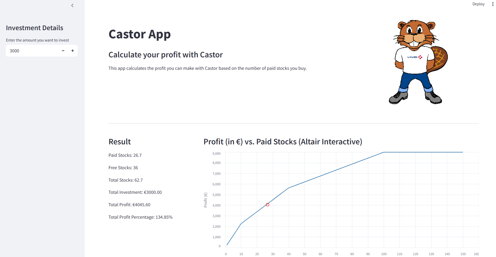

# 📈 Castor Calculator App

The **Castor Calculator App** is a Streamlit-based web application that helps users **calculate the profit** they can make when investing in Castor by purchasing paid stocks. The app includes a bonus calculation system, live visual feedback, and an interactive Altair chart to show potential profit based on varying investment amounts.

 - an example to show how the app looks like

---

## 🚀 Features

- 📊 Calculate number of paid and bonus (free) stocks based on your investment
- 💶 Estimate total profit and profit percentage
- 📈 Visualize profit across different paid stock amounts
- 🧮 Tiered bonus logic:
  - **First 10** stocks: 2 free per paid
  - **11–40**: 1 free per paid
  - **41–100**: 0.5 free per paid
  - **100+**: capped bonus

---

## 📷 Screenshot


---

## 🛠️ Tech Stack

- [Streamlit](https://streamlit.io/) – for building the interactive UI
- [Altair](https://altair-viz.github.io/) – for dynamic data visualization
- [Pandas](https://pandas.pydata.org/) – for data processing

---

## 🧾 Usage

1. **Clone the repo**:
   ```bash
   git clone https://github.com/axians-nl-ba-amersfoort/castor_calculator.git
   cd castor_calculator

2. **Create virtual environment**:
   ```bash
   python -m venv .venv
   .venv\Scripts\activate 
3. **Install dependencies**:
   ```bash
   pip install -r requirements.txt
4. **Run the app**:
   ```bash
   streamlit run main.py

---

<!-- ## Example
 - an example to show how the app looks like -->